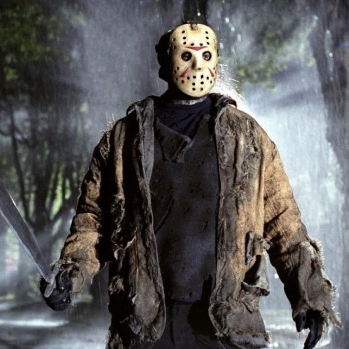
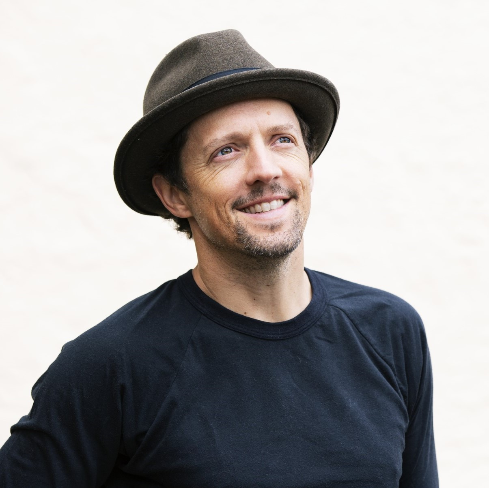
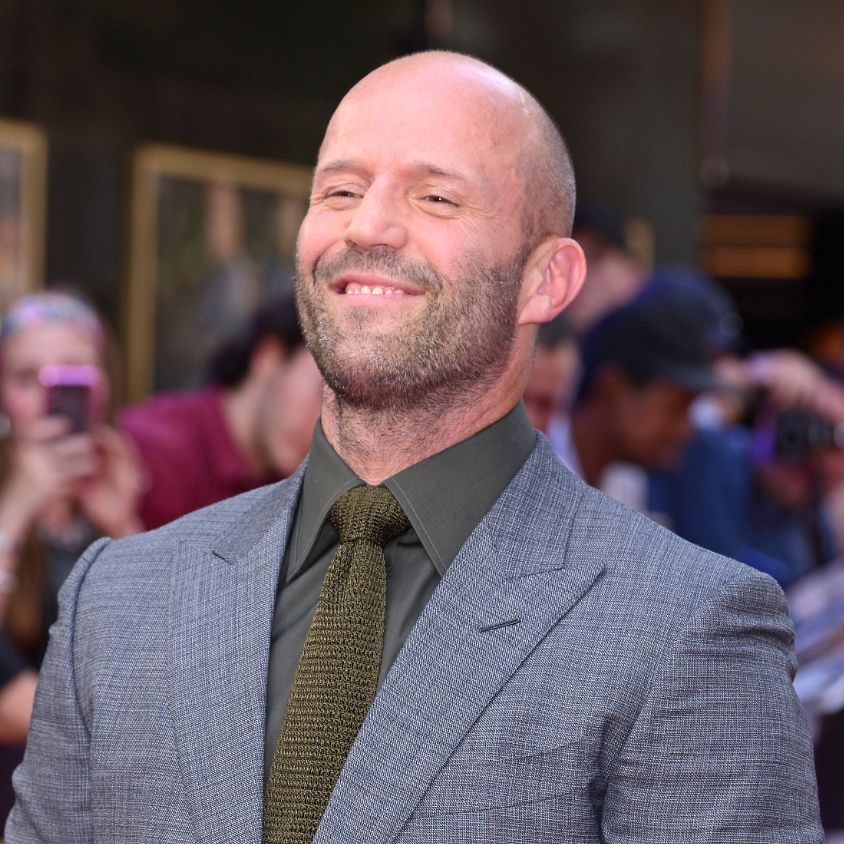
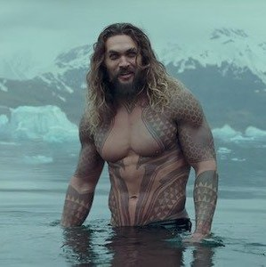

<!DOCTYPE html>
<html lang="en">
<head>
    <meta charset="UTF-8">
    <meta name="viewport" content="width=device-width, initial-scale=1.0">
    <link rel="stylesheet" href="css/style.css">
    <link rel="stylesheet" href="https://fonts.googleapis.com/css?family=Open+Sans">
    <title>Famous Jasons</title>
</head>
<body>
    <h1>Famous Jasons</h1>
    
Hi, my name is Jason Angelo and this is a list of some famous Jasons

<!-- jason voorhees -->

    
    <a href="https://en.wikipedia.org/wiki/Jason_Voorhees">
Jason Voorhees
</a>
    

        The person we think of when we hear the name Jason.
        He is the main character of the Friday the 13th movies. He is
        known for his signature mask and immortality.
    

<!-- jason mraz -->
    
    <a href="https://en.wikipedia.org/wiki/Jason_Mraz">
Jason Mraz
</a>
    

        Known for his hit songs, "I Won't Give Up" and "I'm Yours", Jason Thomas Mraz 
        is an American singer-songwriter and guitarist. He has won two Grammy Awards and received two additional nominations, 
        and has also won two Teen Choice Awards, a People's Choice Award and the Hal David Songwriters Hall of Fame Award.
    

<!-- jason abalos -->
    
    <a href="https://en.wikipedia.org/wiki/Jason_Abalos">
Jason Abalos
</a>
    

        A Filipino actor, host and endorser, Jason Abalos is a former 
        member of Star Magic talents until 2017. He was discovered after joining the reality show, "Star Circle Quest" 
    

<!-- jason statham -->
    
    <a href="https://en.wikipedia.org/wiki/Jason_Statham">
Jason Statham
</a>
    

        Known for his action/thriller roles, Jason Statham is one of the most famous action-stars today. 
        Throughout his film career, Statham has regularly performed his own stage combat and stunts. 
    

<!-- jason gainza -->
    
    <a href="https://en.wikipedia.org/wiki/Jason_Gainza">
Jason Gainza
</a>
    

        A Filipino actor, comdeian and impersonator, Jason Gainza is best known for his role as 
        Bhoy in the Banana Split segment NNNN and Banana Nite segment Ihaw Na.  He was discovered after joining the reality show, "Pinoy Big Brother" 
        where he won second place.
    

<!-- jason momoa -->
    
    <a href="https://en.wikipedia.org/wiki/Jason_Momoa">
Jason Momoa
</a>
    

        Joseph Jason Namakaeha Momoa is an American actor. 
        He is widely known for portraying Arthur Curry / Aquaman in the DC Extended Universe. 
        Momoa also starred as Khal Drogo in the HBO fantasy drama series Game of Thrones (2011–2012)
    

<!-- jason francisco -->
    
    <a href="https://en.wikipedia.org/wiki/Jason_Francisco">
Jason Francisco
</a>
    

        Asawa ni Melai. Jason Veron Francisco is a Filipino actor and comedian. He was a participant and 3rd placer in Pinoy Big Brother: Double Up. 
        He was in the follow-up show Melason In Love with his then girlfriend Melisa Cantiveros.
    

    <h1>Thank You!</h1>
</body>
</html>
